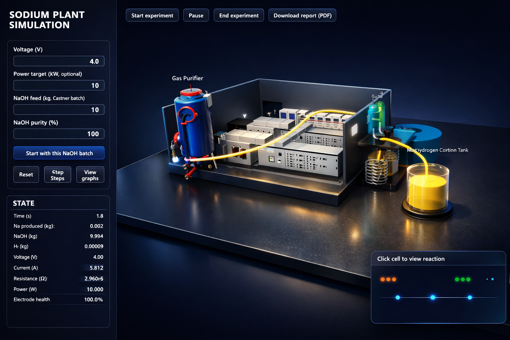
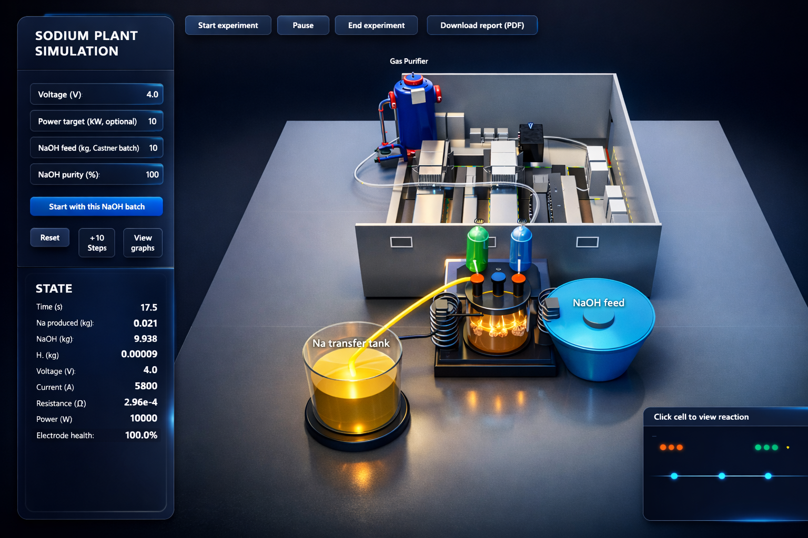
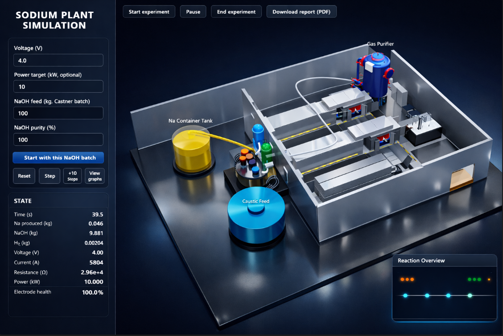

## Sodium Plant Digital Twin – Python + Web 3D

This project is a **pure‑Python sodium plant simulation core** with a **web‑based 3D visualisation**.  
Legacy DWSIM and FreeCAD integration files have been removed; everything now runs with Python + FastAPI + React/Three.js.

### Python core

- `sodium_logic.py` – Faraday‑based sodium production and simple finance helpers.
- `electrical_model.py` – DC supply and transformer/rectifier behaviour, limits, and power.
- `electrode_model.py` – electrode wear, resistance multiplier, and efficiency vs. life.
- `plant_model.py` – central `SodiumPlant` class (time‑step simulation, no DWSIM/FreeCAD).
- `process_mvp.py` – CLI driver to run a simple time‑based simulation in the terminal.
- `api_server.py` – FastAPI server exposing:
  - `POST /api/reset`
  - `POST /api/step`
  - `GET /api/state`
  - `POST /api/reaction_time`
- `battery_matbg_integration.py` – optional link to an external Na‑ion battery model (MATBG project).
- `requirements.txt` – Python dependencies.

### Web front‑end (`sodium-frontend/`)

- React + TypeScript.
- `@react-three/fiber` + `@react-three/drei` + `three` for 3D:
  - Castner‑style electrolysis cell with transparent melt.
  - Cathode/anode geometry with +/− labels.
  - Gas collection trains (H₂ / O₂), labeled tanks, and a connected gas well.
  - Animated gas bubbles in the cell and animated gas flow through pipes.
- Side panel UI:
  - Inputs: current (A), Δt (hours), NaOH batch (kg).
  - Controls: Reset, Step, +10 Steps, Run/Pause, Estimate time.
  - Live state: time, Na/NaOH/Cl₂/H₂ totals, revenue, cost, operating point.
- Microscopic reaction panel:
  - Cathode view: `Na⁺ + e⁻ → Na` animation with labeled ions/electrons and electrode face.
  - Anode view: `OH⁻ → O₂ + e⁻` style oxidation animation.
  - Electrolyte view: Na⁺ / OH⁻ ion motion between electrodes.

### Screenshots & Illustrations

Electrolysis furnace concept art:


In‑app simulation views:





Failure mode visual:


### Install Python dependencies

From the project root (`F:\sodium`):

```bash
python -m pip install -r requirements.txt
```

### Run the pure‑Python MVP (terminal only)

```bash
cd F:\sodium
python process_mvp.py
```

You’ll see sodium production, power, and finance figures printed per time step.

### Run the web 3D simulator

1. Start the API server:

   ```bash
   cd F:\sodium
   python api_server.py
   ```

2. In another terminal, start the front‑end:

   ```bash
   cd F:\sodium\sodium-frontend
   npm install
   npm run dev
   ```

3. Open the browser at:

```text
http://localhost:5173
```

You can now:
- Adjust current, time step, and NaOH feed.
- Step or run the simulation.
- Watch the 3D plant and microscopic reaction views respond to the simulation state.

